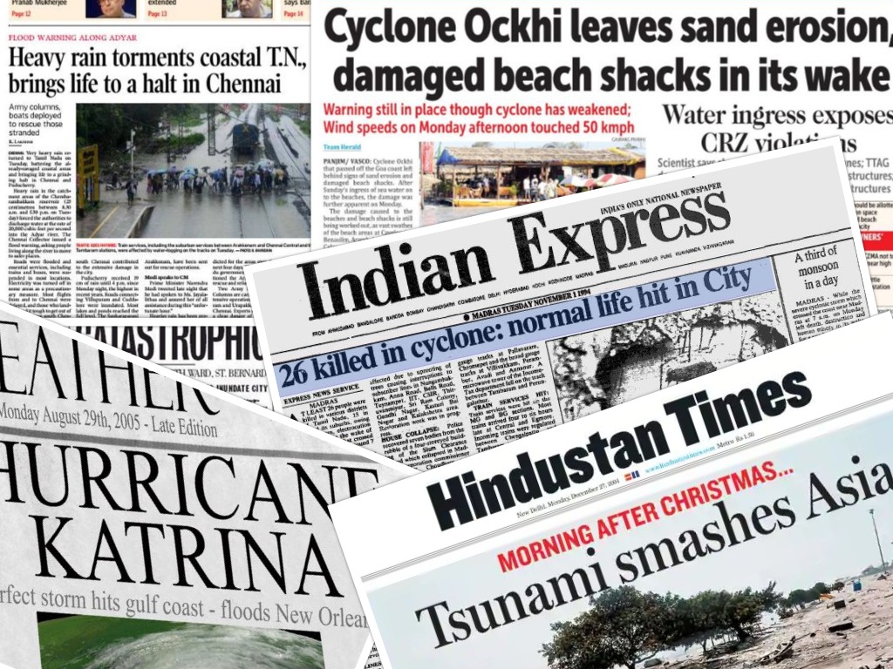

# SailThru

This is what we get to read in the early morning when we take the newspaper in one hand and a cup of coffee tightly gripped in the other. The latest news apps have made it even more horrendous by giving timely updates on the death toll leaving us with a deep-seated anxiety.

Ever had an inkling that the intensity with which such destructions strike could be alleviated if we had received well-timed notifications on certain details of the disaster? It is, of course, true that it is out of human ability (as of now) to predict the occurrence of a disaster beforehand with high precision. But, what if we get to know with what fury the cyclone is going to plump in? What if someone keeps you updated with details of whom to reach out for help when you are stranded in an inundated city? Which evacuation spot is the nearest in case of a nuclear radiation leak? SailThru is the exact "tranquility spot" that you would need in such scenarios.

The application takes pre-disaster concerns and provides post-disaster management assistance. Sufficient checks and balances are ensured in the app such that users can have an authentic reliable entity in their hands. We assume that the app has a large user base and a set of geo-location based verifiable administrative users in positions of responsibility. The following services are provided by the app:

* Pre-Disaster
    * Geo-location based disaster notifications gathered from online news sources that are verified and broadcasted by the administrative user.
    * Protocols and safety measures to be followed are provided to the large user base in a timely manner depending upon the disaster that the region is prone to such that they are adequately prepared.
    * A database of doctors, vets, fire-fighters, police, NGOs is maintained and provided to the users based on location.

* During-Disaster
    * The app provides a platform for users to form groups dynamically during adverse conditions.
    * Explicit support for evacuation to the distressed users by integrating maps with the app.
    * Map-based guidance towards accessible service spots (hospitals, shelters, etc)
    * Inform the local animal-welfare organizations about the disaster-affected regions and also provide a platform for the users to coordinate efforts.
    * Action recommendation system to help the administrative users using feedback from the general users.

* Additional Features
    * Regional language support
    * Audio support for visually-challenged people
    * SMS based two-way communication support in case of internet unavailability 
